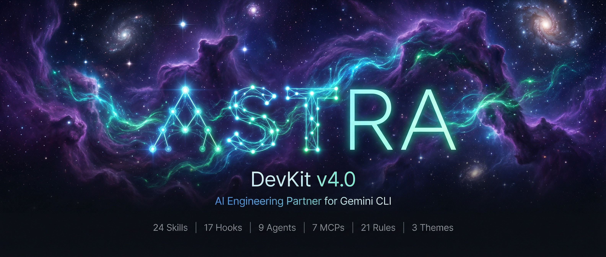
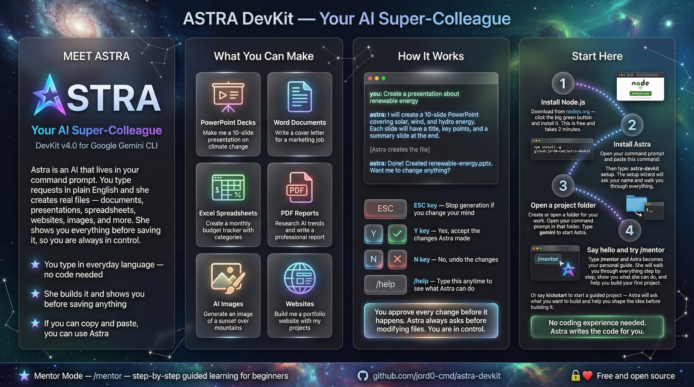
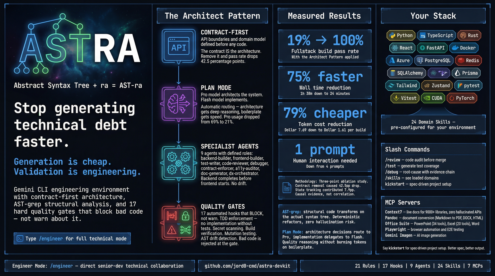

<p align="center">
  
</p>

<p align="center">
  
  
  
  
  
</p>

<p align="center">
  <em>Skills, agents, hooks, MCPs, and standards that turn Gemini from a cold AI into a capable teammate.</em>
</p>

---

## Visual Guides

New to Astra? Start with the guide that matches your experience:

<table>
<tr>
<td width="50%" align="center">

**Beginners Guide**

<a href="docs/images/astra-guide-beginners.png"></a>

*What Astra can do, how to talk to her, getting started*
<br>Or run: `astra-devkit guide beginner`

</td>
<td width="50%" align="center">

**Developers Guide**

<a href="docs/images/astra-guide-developers.png"></a>

*Architect Pattern, quality gates, measured results, your stack*
<br>Or run: `astra-devkit guide developer`

</td>
</tr>
</table>

---

## What Is This?

Astra DevKit is a complete configuration package for [Gemini CLI](https://github.com/anthropics/anthropic-cli). It gives your Gemini CLI a warm personality, professional coding standards, specialist agents, automated quality gates, MCP servers for document/image generation, and 24 domain skills — all installable with a single command.

Astra is the senior dev on your team who's sharp, approachable, and genuinely wants the code to be good. She learns your name, remembers your preferences, adapts to your experience level, and enforces best practices automatically through hooks.

### The Numbers

| Component | Count | Description |
|-----------|-------|-------------|
| **Skills** | 24 | On-demand expertise: Python, TypeScript, Rust, React, FastAPI, Docker, Azure, databases, PDF reports, card builder, and more |
| **Hooks** | 17 | Automated quality gates: secret scanning, TDD enforcement, build gates, mutation testing, drift detection |
| **Agents** | 9 | Specialist subagents: backend/frontend builders, code reviewer, debugger, test writer, contract enforcer |
| **MCP Servers** | 7 | Context7, Pandoc, PowerPoint, Excel, Word, Gemini Imagen, Playwright |
| **Standards** | 21 | Always-loaded development rules — no placeholders, no shortcuts, no excuses |
| **Themes** | 3 | Astra (dark professional), Retro Green (CRT terminal), Retro Amber (warm CRT) |

---

## It's Free

Astra DevKit is free and open source. Gemini CLI is free too. All you need is a **Google account** (Gmail) — no credit card, no API key, no cloud project.

Google gives you **1,000 AI requests per day** for free with access to **Gemini 3 Pro** and a **1 million token context window**. Here's what that gets you in a single day:

### What 1,000 Free Requests Gets You

| What You Build | Requests Used | How Many Per Day |
|---------------|--------------|-----------------|
| **A complete fullstack web app** (backend + frontend + API contract + tests) | ~60-80 | **10-15 apps** |
| Fix a bug, write a function, explain code | ~1-5 | **200+** |
| Create a PowerPoint presentation | ~5-10 | **100+** |
| Generate a PDF report from data | ~5-10 | **100+** |
| Deep research on a topic | ~10-20 | **50+** |
| Build a website from a description | ~20-40 | **25+** |

**A typical day**: Build a fullstack app in the morning, debug a few issues after lunch, create a presentation, research a topic, generate some docs — and you've still got requests left over.

> **No features are locked behind a paywall.** Skills, hooks, agents, MCP servers, plan mode, subagent delegation — everything works on the free tier. The only difference between free and paid is daily request count.

| Tier | Daily Requests | Models | Cost |
|------|---------------|--------|------|
| **Free (Google Account)** | **1,000/day** | **Flash + Pro** | **$0** |
| Google AI Pro | 1,500/day | All | $19.99/mo |
| Google AI Ultra | 2,000/day | All + Deep Think | $249.99/mo |

<details>
<summary><strong>Don't have a Google account?</strong></summary>

1. Go to [accounts.google.com/signup](https://accounts.google.com/signup)
2. Create a free account (you get a Gmail address with it)
3. That's it — this is the same account you use for YouTube, Google Drive, etc.

**Important**: Use a personal Gmail account, not a work/school Google Workspace email. The free tier requires a personal account.

</details>

<details>
<summary><strong>How does authentication work?</strong></summary>

When you run `gemini` for the first time, it opens your browser and asks you to sign in with Google. Click through, and you're done. Your credentials are cached locally — you won't need to sign in again.

That's it. No API keys to manage, no environment variables to set, no cloud console to navigate.

If you're on a headless server (no browser), you can use a [Gemini API key](https://aistudio.google.com/apikey) instead, but the free tier is more limited (250 requests/day, Flash model only).

</details>

<details>
<summary><strong>What counts as a "request"?</strong></summary>

One message to Astra = one request in simple mode. But in agent mode (like the Architect Pattern), a single prompt can spawn multiple model calls — planning, tool use, subagent delegation. A complex fullstack build might use 50-100 requests.

For most people, 1,000/day is plenty. If you're doing heavy agentic work all day, you might hit the limit. The `/stats model` command shows your current usage.

</details>

---

## Quick Start

You need two things: **Node.js** and a **Google account**. The setup wizard handles everything else.

```bash
npm install -g github:jord0-cmd/astra-devkit
astra-devkit setup
```

The setup wizard will:
- Check for Gemini CLI and install/upgrade it if needed
- Walk you through signing in with your Google account
- Ask your name, experience level, and what you build
- Deploy all skills, hooks, agents, standards, and themes
- Detect missing MCP dependencies and offer to install them

Then start coding:

```bash
gemini
```

You'll see the Astra banner, and she'll introduce herself.

---

## Step 1: Install Node.js

Node.js is the only thing you need to install manually. It comes with `npm` (the package manager) built in.

<details>
<summary><strong>Windows</strong></summary>

**Option A: Download the installer (easiest)**

1. Go to [nodejs.org](https://nodejs.org/)
2. Download the **LTS** version (the big green button)
3. Run the installer — click Next through the defaults
4. Restart your terminal (PowerShell or Command Prompt)
5. Verify: `node --version` should show `v20` or higher

**Option B: Using winget (if you have it)**

```powershell
winget install OpenJS.NodeJS.LTS
```

Restart your terminal after install.

</details>

<details>
<summary><strong>macOS</strong></summary>

**Option A: Download the installer**

1. Go to [nodejs.org](https://nodejs.org/)
2. Download the **LTS** version
3. Run the `.pkg` installer
4. Verify: `node --version` in Terminal

**Option B: Using Homebrew**

```bash
brew install node@20
```

**Option C: Using nvm (version manager)**

```bash
curl -o- https://raw.githubusercontent.com/nvm-sh/nvm/v0.40.1/install.sh | bash
source ~/.bashrc
nvm install 20
```

</details>

<details>
<summary><strong>Linux (Ubuntu / Debian)</strong></summary>

**Option A: NodeSource repository (recommended)**

```bash
curl -fsSL https://deb.nodesource.com/setup_20.x | sudo -E bash -
sudo apt install -y nodejs
```

**Option B: Using nvm**

```bash
curl -o- https://raw.githubusercontent.com/nvm-sh/nvm/v0.40.1/install.sh | bash
source ~/.bashrc
nvm install 20
```

**Option C: Snap**

```bash
sudo snap install node --classic --channel=20
```

</details>

<details>
<summary><strong>Linux (Fedora / RHEL)</strong></summary>

```bash
sudo dnf install -y nodejs
```

Or via NodeSource:

```bash
curl -fsSL https://rpm.nodesource.com/setup_20.x | sudo bash -
sudo dnf install -y nodejs
```

</details>

<details>
<summary><strong>Linux (Arch)</strong></summary>

```bash
sudo pacman -S nodejs npm
```

</details>

Verify your install on any platform:

```bash
node --version   # Should show v20.x.x or higher
npm --version    # Should show 10.x.x or higher
```

---

## Step 2: Install Astra DevKit

```bash
npm install -g github:jord0-cmd/astra-devkit
```

This installs the `astra-devkit` command globally. It also installs `ast-grep` (for code analysis) automatically.

---

## Step 3: Run Setup

```bash
astra-devkit setup
```

The wizard walks you through everything:

1. **Checks Node.js** version
2. **Checks for Gemini CLI** — if not installed or outdated, offers to install/upgrade it (requires the preview channel for agents and skills support)
3. **Checks for Python + uv** — warns if missing (needed for document MCPs), but doesn't block setup
4. **Asks your name** — Astra will use it naturally in conversation
5. **Asks your experience level** — beginner (detailed), intermediate (balanced), or senior (concise)
6. **Asks what you build** — backend, frontend, fullstack, data, or libraries
7. **Deploys everything** — 24 skills, 17 hooks, 9 agents, 4 standards, 3 themes
8. **Merges settings** — preserves your existing auth and preferences

### After Setup: Configure MCPs

```bash
astra-devkit mcps
```

This shows an interactive menu of all 7 MCP servers. It detects which dependencies you have and which you're missing:

- **npx-based MCPs** (Context7, Playwright, Imagen) work immediately — you already have Node.js
- **uvx-based MCPs** (Pandoc, PowerPoint, Excel, Word) need Python + uv — the wizard offers to install them for you
- **Pandoc MCP** additionally needs the `pandoc` binary — the wizard offers to install it too

---

## Step 4: Verify

```bash
astra-devkit doctor
```

Runs a full health check. You should see all green:

```
Astra DevKit — Health Check

  ✓ Node.js: v20.x.x (OK)
  ✓ Gemini CLI: 0.36.x
  ✓ Python + uv: Python 3.x.x + uv installed
  ✓ Skills: 24 installed (OK)
  ✓ Hooks: 17 installed (OK)
  ✓ Agents: 9 installed (OK)
  ✓ Standards: 4 installed (OK)
  ✓ Settings + MCPs: 7 MCPs, hooks ON, skills ON
  ✓ Themes: 3 available (OK)
  ✓ ast-grep: ast-grep 0.x.x
  ✓ Pandoc: pandoc 3.x.x

11/11 checks passed.
```

---

## Step 5: Start Coding

```bash
gemini
```

That's it. Astra is ready.

On your first run, Gemini will open your browser to sign in with your Google account. This is a one-time step — after that, you're authenticated automatically. All you need is a free Google account (Gmail). No credit card, no API key. You get 1,000 AI requests per day for free.

---

## What's Inside

### 24 Domain Skills

Skills use progressive disclosure — only metadata loads until activated. No context bloat.

| Skill | What It Covers |
|-------|---------------|
| `kickstart` | Guided project discovery — scoping, tech stack, experience calibration, brief generation |
| `python-standards` | uv, ruff, mypy, polars, httpx, pydantic v2, pytest, hypothesis, structlog |
| `typescript-standards` | Strict mode, Vitest, Zustand, TanStack Query, Zod, Biome |
| `rust-standards` | thiserror/anyhow, tokio, axum, proptest, cargo-nextest |
| `backend-patterns` | FastAPI, SQLAlchemy 2.0, DI, WebSocket, request tracing, health checks |
| `frontend-patterns` | React 19, shadcn/ui, Tailwind, accessibility, Core Web Vitals |
| `integration-patterns` | OpenAPI type sync, API client, CORS, Docker Compose |
| `database-patterns` | PostgreSQL, Cosmos DB, Redis, SQLAlchemy, Prisma, Alembic, query optimisation |
| `docker-ops` | Multi-stage builds, Compose, security, debugging |
| `azure-ops` | Functions, Blob Storage, Key Vault, Bicep, DevOps Pipelines |
| `ml-ops` | PyTorch, CUDA, Docker GPU, ONNX, model serving |
| `git-github` | Conventional commits, branching, gh CLI, GitHub Actions |
| `log-analysis` | Docker debugging, structured logging, root cause analysis |
| `openwebui` | OpenWebUI/Ollama API, RAG workflows, Docker deployment |
| `card-builder` | **NEW** — Interactive OpenWebUI dashboard card + model config generator |
| `pdf-reports` | **NEW** — Professional PDF reports via HTML + Pandoc MCP pipeline |
| `ollama-ops` | **NEW** — Local Ollama model management, VRAM budgeting, OpenWebUI API |
| `aag-engine` | AST-based architectural graph — scans models, routes, types, detects drift |
| `mutation-engine` | AST mutation testing — verifies test suite quality |
| `property-testing` | Hypothesis/proptest — property-based testing patterns |
| `experience-replay` | Learn from past failures — pattern matching across sessions |
| `ast-ops` | ast-grep structural code search and modification |
| `project-onboarding` | GEMINI.md creation, module summaries |
| `hooks-guide` | Hook system reference for building custom automation |

### 9 Specialist Agents

| Agent | Purpose | How to Invoke |
|-------|---------|---------------|
| `backend-builder` | Builds backend services following contract-first pattern | Delegated by Astra during fullstack builds |
| `frontend-builder` | Builds frontend from API contract types | Delegated by Astra during fullstack builds |
| `code-reviewer` | Bugs, security, logic, standards compliance | `@code-reviewer` |
| `test-writer` | TDD test generation across all frameworks | `@test-writer` |
| `debugger` | Systematic root-cause analysis with evidence | `@debugger` |
| `doc-generator` | Module summaries, API docs, project docs | `@doc-generator` |
| `contract-enforcer` | Validates API contract compliance | Invoked by hooks automatically |
| `dx-orchestrator` | Full project orchestration — delegates to specialists | Top-level architecture agent |
| `a11y-auditor` | Accessibility audit and WCAG compliance | `@a11y-auditor` |

### 17 Automated Hooks

All hooks are Node.js (`.mjs`) — cross-platform, no bash/PowerShell split. They write reports to `.astra/gate-reports.jsonl` when they trigger.

| Hook | Event | What It Does |
|------|-------|-------------|
| `context-loader` | SessionStart | Loads user preferences, displays Astra banner, detects kickstart state |
| `skill-preflight` | BeforeAgent | Detects tech keywords, nudges relevant skill activation |
| `spec-mining` | BeforeAgent | Detects ambiguous specs, nudges clarifying questions before contract |
| `secret-scanner` | BeforeTool | Blocks file writes containing API keys, passwords, tokens |
| `code-standards` | BeforeTool | Blocks `requirements.txt` (use `pyproject.toml`), warns on hardcoded state |
| `test-gate` | BeforeTool | TDD enforcement — blocks implementation without tests |
| `contract-first-gate` | BeforeTool | Warns when frontend code is written without an API contract |
| `auto-lint` | AfterTool | Runs ruff/biome/rustfmt after file writes |
| `build-gate` | AfterAgent | Runs build/type checks after coding, 3-strike circuit breaker |
| `fault-localiser` | AfterAgent | Parses test failures into fault capsules with causal reasoning |
| `cegis-repair` | AfterAgent | Tracks repeated failures, provides counterexamples, escalates after 3 retries |
| `mutation-gate` | AfterAgent | Runs AST mutations on critical paths to detect test gaps |
| `artifact-checker` | AfterAgent | Scans for required project artifacts, nudges creation of missing ones |
| `hippocampus` | AfterAgent | Ensures GEMINI.md exists with required sections for session continuity |
| `drift-check` | AfterAgent | Runs AAG engine to detect state drift between backend and frontend |
| `agent-telemetry` | AfterAgent | Captures failure signals and tool usage for analysis |
| `root-files-gate` | BeforeTool | Prevents writing to repository root (forces proper project structure) |

### 7 MCP Servers

Model Context Protocol servers give Astra new capabilities beyond code:

| MCP | Category | What It Does | Requires |
|-----|----------|-------------|----------|
| **Context7** | Coding | Live documentation for 9,000+ libraries — no hallucinated APIs | Node.js |
| **Pandoc** | Documents | Convert between any document format (Markdown, PDF, DOCX, HTML, LaTeX) | Python + uv + pandoc |
| **PowerPoint** | Documents | Create and edit presentations (34 tools) | Python + uv |
| **Excel** | Documents | Create and edit spreadsheets (20 tools) | Python + uv |
| **Word** | Documents | Create and edit rich documents | Python + uv |
| **Gemini Imagen** | Images | AI image generation via Gemini | Node.js + `GEMINI_API_KEY` |
| **Playwright** | Coding | Browser automation and testing | Node.js |

MCPs are selectable during setup — enable only what you need.

### 3 Custom Themes

| Theme | Style | Preview |
|-------|-------|---------|
| **Astra** | Dark professional — blue accents, green success, GitHub-inspired | `#0d1117` background, `#58a6ff` links |
| **Retro Green** | CRT terminal — phosphor green on black | `#0a0a0a` background, `#33ff33` text |
| **Retro Amber** | Warm CRT terminal — amber on dark | `#0a0800` background, `#ffb000` text |

### 21 Always-On Development Rules

Loaded every session via `@import` — not optional, not on-demand:

1. Never make unauthorised changes
2. Dependency management is mandatory
3. No placeholders
4. Questions vs code requests
5. No assumptions
6. Security is non-negotiable
7. Be honest about capabilities
8. Preserve functional requirements
9. Evidence-based responses
10. No hardcoded examples
11. Intelligent logging
12. Modern Python packaging (`pyproject.toml`, never `requirements.txt`)
13. Resist tutorial defaults
14. Use current library APIs — no deprecated patterns
15. Asymmetric planning — match strategy to domain
16. Contract-first integration
17. Domain types over primitives
18. Accessibility is mandatory
19. AST-aware code modification
20. Runtime tool creation
21. Build at project root

Plus: TDD standards, test pyramid, hook execution policy, skill compatibility matrix.

### 60 Custom Loading Phrases

Because `"Deploying to prod on a Friday..."` is more fun than a spinner.

---

## CLI Commands

After installing globally:

```bash
astra-devkit             # Launch Gemini (runs setup first if needed)
astra-devkit setup       # Interactive setup (profile, MCPs, theme, desktop shortcut)
astra-devkit update      # Update all components to latest
astra-devkit mcps        # Interactive MCP enable/disable with dependency detection
astra-devkit theme       # Switch between themes
astra-devkit doctor      # Health check — verifies all components
astra-devkit extend      # Install internal team skill pack (requires GitHub access)
astra-devkit guide beginner   # Open the beginner visual guide
astra-devkit guide developer  # Open the developer visual guide
astra-devkit uninstall   # Clean removal of all Astra components
astra-devkit help        # Show available commands
astra-devkit --version   # Show version
```

> **Windows users**: Setup offers to create a desktop shortcut with the Astra icon. Double-click it to launch Gemini in Windows Terminal.

### Doctor Output (example)

```
Astra DevKit — Health Check

  ✓ Node.js: v20.x.x (OK)
  ✓ Gemini CLI: 0.36.x
  ✓ Python + uv: Python 3.x.x + uv installed
  ✓ Skills: 21 installed (OK)
  ✓ Hooks: 17 installed (OK)
  ✓ Agents: 9 installed (OK)
  ✓ Standards: 4 installed (OK)
  ✓ Settings + MCPs: 7 MCPs, hooks ON, skills ON
  ✓ Themes: 3 available (OK)
  ✓ ast-grep: ast-grep 0.x.x
  ✓ Pandoc: pandoc 3.x.x

11/11 checks passed.

  ★ Internal skill pack: 4.0.0  (or: — not installed)

All systems operational. You're good to go.
```

---

## What Gets Installed

```
~/.gemini/
├── GEMINI.md              Astra persona + @imported standards
├── settings.json          Theme, hooks, agents, skills, MCPs (merged — auth preserved)
├── user.json              Your name + preferences (created during setup)
├── standards/
│   ├── rules.md           21 Rules, Confirm Protocol, Three Fix, Quality Gates
│   ├── testing.md         TDD, test pyramid, test isolation, AI+TDD synergy
│   ├── hooks.md           Hook policy, execution order, block format, escape hatches
│   └── skills.md          Skill compatibility matrix for common tech stacks
├── skills/                24 domain skill directories (SKILL.md + references/)
├── agents/                9 specialist agent definitions (.md)
├── hooks/                 17 Node.js automation scripts (.mjs)
├── themes/                3 custom theme definitions (.json)
└── commands/              Custom slash commands (TOML)
```

Your existing config is preserved — the installer merges settings, it doesn't overwrite.

---

## The Architect Pattern

Astra's flagship capability is the **Architect Pattern** for fullstack projects — the lever that took a complex fullstack scenario from 19% to 100% pass rate:

1. **Contract-First** — Before any code, create `docs/api-contract.md` with the full domain model, endpoints, enum values, and shared conventions
2. **Architectural State** — Create `docs/architectural-state.md` as a living document tracking completion, decisions, and quality gates
3. **Orchestrated Delegation** — Astra acts as Architect, delegating to `@backend-builder` (reads/updates contract) then `@frontend-builder` (derives types from contract)
4. **Sequencing** — Backend completes and updates the contract BEFORE frontend starts
5. **Quality Gates** — Hooks automatically enforce structlog, contract-first, drift detection

### Proven Results

| Metric | Without DevKit | With DevKit v4 |
|--------|---------------|----------------|
| Fullstack pass rate | 19% | 100% |
| Cost per run | $7.69 (4 prompts) | $1.61 (1 prompt) |
| Wall time | 1h 38m | 24m 41s |
| Human prompts needed | 4 | 1 |

Validated across CRUD, CLI tools, data pipelines, WebSocket servers, and library packaging domains. Three-point ablation study confirms the contract is the critical lever (42.5 percentage point drop when removed).

---

## Customisation

### Rename the Persona
Edit `~/.gemini/GEMINI.md` — change "Astra" to whatever you like. The personality and standards still work regardless of name.

### Disable Individual Skills
```
/skills disable skill-name
```
Or delete the skill directory from `~/.gemini/skills/`.

### Disable Hooks
Set `"hooksConfig": { "enabled": false }` in `~/.gemini/settings.json` to disable all hooks, or delete individual hook files from `~/.gemini/hooks/`.

### TDD Gate Escape Hatch
Set `ASTRA_TDD=off` in your environment to bypass TDD enforcement for quick prototyping.

### Change Theme
Run `astra-devkit theme` or use `/theme` inside a Gemini session.

### Disable Loading Phrases
Set `"loadingPhrases": "off"` in `settings.json`.

### Project-Level Overrides
Add a `.gemini/settings.json` in any project to override global settings for that project only.

### Add Your Own MCPs
Run `astra-devkit mcps` to toggle servers, or edit the `mcpServers` block in `~/.gemini/settings.json` directly.

---

## For Teams

Astra is designed for development teams. The `kickstart` skill helps developers new to AI coding tools get started with guided discovery instead of staring at a blank prompt.

The `user.json` system remembers each team member's name, experience level, and explanation preferences — so Astra adapts to each person individually:

- **Beginners** get detailed explanations and step-by-step guidance
- **Intermediate** developers get balanced context
- **Senior** engineers get concise, direct responses

---

## Cross-Platform

Everything works on Linux, macOS, and Windows:

- **Hooks** are Node.js (`.mjs`) — no bash/PowerShell split
- **Config paths** use `os.homedir()` — resolves correctly everywhere
- **Setup wizard** is interactive Node.js — same experience on all platforms
- **MCP servers** use `npx` (Node.js) and `uvx` (Python) — both cross-platform
- **Installers** available in bash (`install.sh`), PowerShell (`install.ps1`), and Node.js (`astra-devkit setup`)

---

## Project Structure

```
gemini-config/
├── GEMINI.md              # Astra persona definition
├── settings.json          # Full config (theme, hooks, MCPs, skills, agents)
├── skills/                # 24 domain skills
│   ├── kickstart/         #   Guided project discovery
│   ├── python-standards/  #   Python best practices
│   ├── card-builder/      #   OpenWebUI card generator
│   ├── pdf-reports/       #   PDF report pipeline
│   ├── ollama-ops/        #   Local model management
│   └── ...
├── hooks/                 # 17 automation hooks (Node.js)
├── agents/                # 9 specialist agents
├── standards/             # 4 always-loaded standards files (21 rules)
├── themes/                # 3 custom themes
├── astra-devkit/          # npm package source
│   ├── bin/               #   CLI entry point
│   ├── lib/               #   Setup wizard, MCP selector, doctor, installer
│   └── config/            #   Bundled components for deployment
├── install.sh             # Bash installer (Linux/macOS)
├── install.ps1            # PowerShell installer (Windows)
└── docs/                  # Architecture documentation
```

---

## Diagnostics

If something's not working:

```bash
# Run the full health check
astra-devkit doctor

# Check if hooks are firing
ls ~/.gemini/hooks/

# Check MCP config
cat ~/.gemini/settings.json | python3 -c "import json,sys; s=json.load(sys.stdin); print(json.dumps(s.get('mcpServers',{}), indent=2))"

# Check gate reports (what hooks have blocked)
cat .astra/gate-reports.jsonl 2>/dev/null
```

---

## Version History

| Version | Date | Highlights |
|---------|------|-----------|
| **v4.0** | 2026-03-28 | npm package, 7 MCPs, card builder, PDF reports, ollama ops, 3 themes, setup wizard, 24 skills, 17 hooks |
| **v3.0** | 2026-03-27 | Architect Pattern, contract-first, AAG engine, mutation testing, 21 rules, 9 agents |
| **v2.0** | 2026-03-25 | Hooks system, TDD gates, build gates, secret scanner, 17 skills |
| **v1.0** | 2026-03-24 | Initial release — persona, standards, 4 agents, 7 hooks |

---

## Research

The DevKit is backed by systematic testing via the [Astra Harness](https://github.com/jord0-cmd/astra-harness) — an automated test framework that scores Gemini CLI output against YAML-defined scenarios.

Key findings:
- **Tutorial gravity**: LLM training priors beat passive context. Prescriptive imperatives win.
- **Progressive disclosure**: 83-line SKILL.md outperformed 565-line encyclopedia by 2x.
- **Contract-first**: The API contract IS the architecture. 19% without, 87% with.
- **The Factory Over the Hero**: Better environment beats bigger model. Pro model usage dropped from 69% to 21%.
- **Friction equals tokens**: Reducing tool friction shifts work from expensive to cheap models.

15 research documents and a paper ("The Factory Over the Hero") available in the research archive.

---

## License

MIT

---

## Credits

Built by [jord0-cmd](https://github.com/jord0-cmd) with [Rayne](https://github.com/jord0-cmd) and the Council (Vesper, Sloane, Astra).
